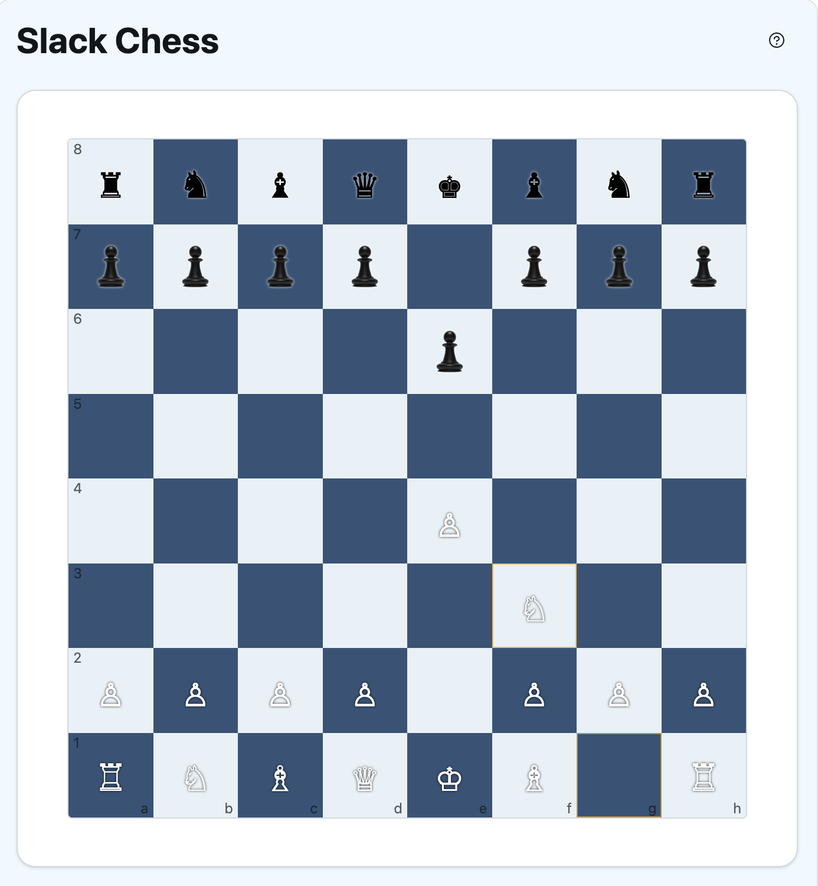
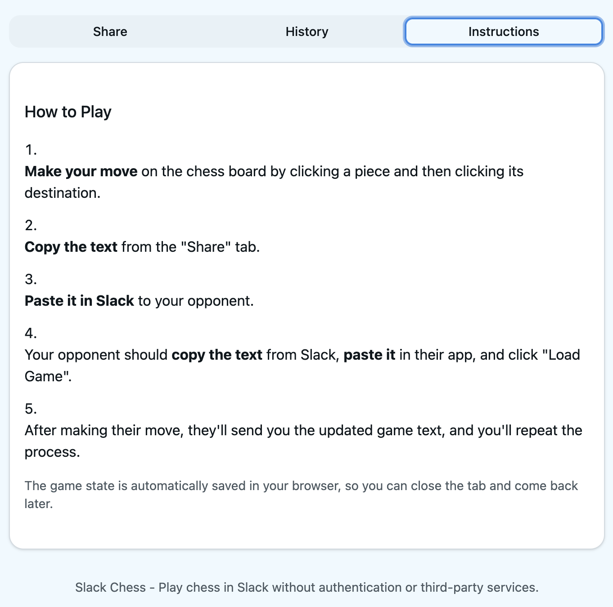
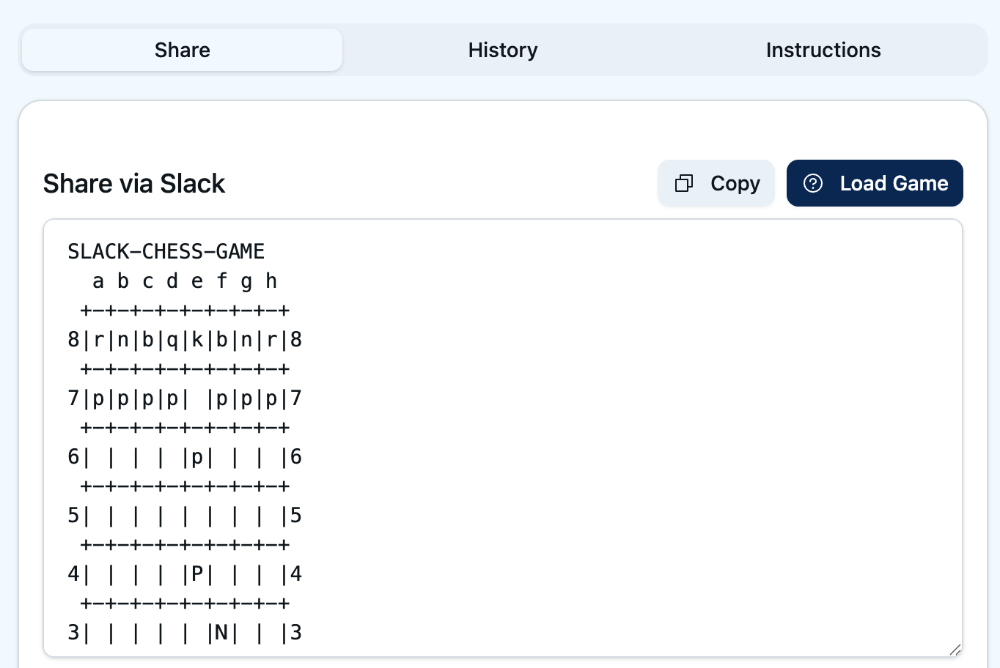

# DM-Chess

Play chess with a colleague right from your DMs. No apps, no logins — just copy, paste, and play.



## What is this?

DM-Chess is a lightweight chess game you play by sharing text over Slack, Teams, or any messaging app. Make your move in the browser, copy the game state, paste it to your opponent. They paste it back into their browser, make their move, and send it back.

There's nothing to install and no accounts to create.

**Play it here: [dvelton.github.io/dm-chess](https://dvelton.github.io/dm-chess)**

## How it works

1. Open the app and make your move by clicking a piece and then its destination.
2. Go to the **Share** tab and either:
   - **Copy the ASCII text** and paste it in Slack/Teams, or
   - **Copy a share link** your opponent can open directly.
3. Your opponent loads the game (paste text + "Load Game", or just open the link), makes their move, and sends it back.
4. Repeat until checkmate.

The game auto-saves in your browser between sessions.

## Features

- Full chess rules via [chess.js](https://github.com/jhlywa/chess.js) — check, checkmate, stalemate, castling, en passant, pawn promotion, draw detection
- ASCII board output for sharing in any text channel
- URL-based sharing (game state encoded in query params)
- Move history with step-through replay
- Captured piece tracking
- Persistent local storage — close the tab and come back later

## Screenshots

| Start | Mid-game | Move history |
|-------|----------|--------------|
|  |  |  |

## Development

```bash
npm install
npm run dev
```

Build for production:

```bash
npm run build
```

Deploys automatically to GitHub Pages on push to `main`.

## Tech stack

React, TypeScript, Vite, Tailwind CSS, chess.js, Radix UI primitives.

## License

[MIT](LICENSE)
